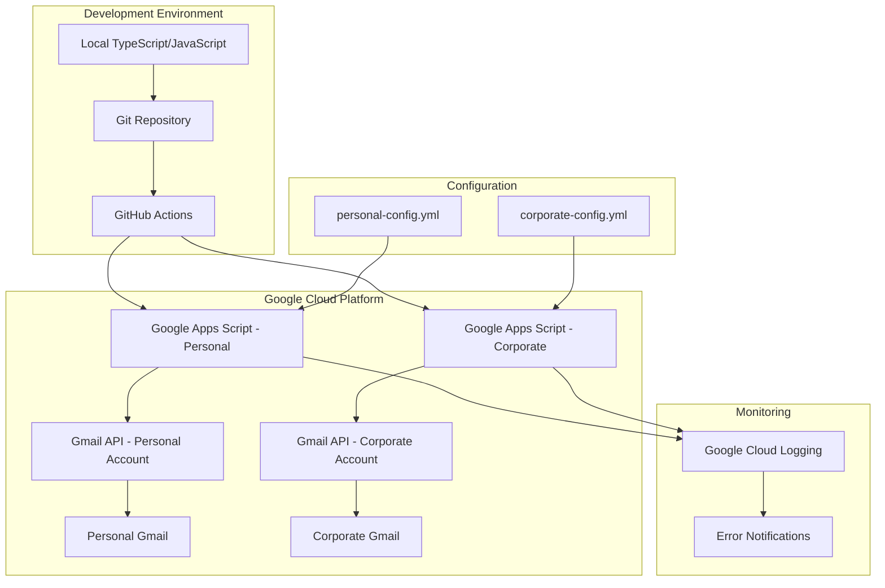

# Gmail Automation System Architecture

## Table of Contents
- [Overview](#overview)
- [System Architecture](#system-architecture)
- [Technology Stack](#technology-stack)
- [Configuration Management](#configuration-management)
- [Deployment Strategy](#deployment-strategy)
- [Code Organization](#code-organization)
- [Threading Logic](#threading-logic)
- [Filtering Rules](#filtering-rules)
- [Multi-Account Support](#multi-account-support)
- [TypeScript Migration Path](#typescript-migration-path)
- [Security Considerations](#security-considerations)
- [Monitoring & Logging](#monitoring--logging)
- [Development Workflow](#development-workflow)
- [Testing Strategy](#testing-strategy)
- [Future Enhancements](#future-enhancements)

## Overview

This system automates Gmail email management using Google Apps Script, providing intelligent filtering, thread-aware aging, and priority detection for both personal and corporate Gmail accounts. The solution addresses the limitations found in previous IMAP-based approaches by leveraging Gmail's native API for full threading support.

### Key Features
- **Thread-aware processing**: Proper Gmail thread handling using native APIs
- **Multi-account support**: Separate instances for personal and corporate accounts
- **Intelligent priority detection**: Company email analysis with superior identification
- **Tiered age-off system**: Different TTL for read vs unread messages
- **GitHub-based deployment**: Full CI/CD pipeline with automated deployments
- **Configuration-driven**: YAML-based rule definitions
- **Mobile synchronization**: Automatic sync across all Gmail clients

### Problem Statement
Previous IMAP-based implementations failed due to Gmail's X-GM-THRID header being unavailable through standard IMAP protocols. This system solves that by using Google Apps Script's native Gmail API access.

## System Architecture



### Component Overview

1. **Local Development**: TypeScript/JavaScript development with full IDE support
2. **Version Control**: Git-based workflow with GitHub repository
3. **CI/CD Pipeline**: GitHub Actions for automated testing and deployment
4. **Apps Script Instances**: Separate instances for each Gmail account
5. **Configuration Management**: YAML-based rule definitions per account
6. **Gmail API Integration**: Native threading and labeling support
7. **Monitoring**: Cloud logging and error notification system

## Technology Stack

### Core Technologies
- **Google Apps Script**: Primary execution environment
- **Gmail API**: Native email threading and manipulation
- **Google Cloud Logging**: Centralized logging and monitoring
- **GitHub Actions**: CI/CD pipeline automation
- **Clasp CLI**: Local development and deployment tool

### Development Tools
- **TypeScript** (optional): Type-safe development
- **ESLint/Prettier**: Code quality and formatting
- **Jest**: Unit testing framework
- **YAML**: Configuration file format
- **Mermaid**: Architecture documentation

### Dependencies
```json
{
  "@google/clasp": "^2.4.2",
  "@types/google-apps-script": "^1.0.83",
  "typescript": "^5.0.0",
  "eslint": "^8.0.0",
  "prettier": "^3.0.0",
  "jest": "^29.0.0",
  "yaml": "^2.3.0"
}
```

## Configuration Management

### Configuration Structure
Each account has its own YAML configuration file based on the successful `imap-filter-rs-v2` model:

**Note:** YAML configuration uses hyphens (`-`) for multi-word keys (e.g., `message-filters`, `script-id`, `exclude-labels`, `require-all-messages-aged`), which are automatically converted to underscores (`_`) when accessed in JavaScript/TypeScript code (e.g., `config.message_filters`, `account.script_id`, `filter.exclude_labels`, `threading.require_all_messages_aged`).

#### Personal Account (`configs/personal-config.yml`)
```yaml
# Personal Gmail Configuration
account:
  name: "personal"
  email: "scott.a.idler@gmail.com"
  script-id: "your-personal-script-id"

# Message filtering rules
message-filters:
  # High-priority personal emails
  - name: "family-urgent"
    to: ['scott.a.idler@gmail.com']
    cc: []
    from: ['*@family-domain.com', 'important-person@gmail.com']
    labels: ['INBOX']
    actions:
      - type: "star"
      - type: "flag"
        label: "Important"

  # Newsletter management
  - name: "newsletters"
    from: ['*@newsletter.com', '*@substack.com']
    labels: ['INBOX']
    actions:
      - type: "move"
        destination: "Newsletters"

# State-based filtering (age-off rules)
state-filters:
  # Protected messages
  - name: "starred-protection"
    labels: ['Important', 'Starred']
    ttl: "keep"

  # Standard inbox cleanup
  - name: "inbox-cleanup"
    labels: ['INBOX']
    exclude-labels: ['Important', 'Starred']
    ttl:
      read: "7d"
      unread: "21d"
    actions:
      - type: "move"
        destination: "Archive"

  # Newsletter cleanup
  - name: "newsletter-cleanup"
    labels: ['Newsletters']
    ttl:
      read: "3d"
      unread: "21d"
    actions:
      - type: "delete"

# Threading configuration
threading:
  enabled: true
  # Only age-off threads when ALL messages meet criteria
  require-all-messages-aged: true
  # Preserve threads with recent activity
  recent-activity-threshold: "24h"
```

#### Corporate Account (`configs/corporate-config.yml`)
```yaml
# Corporate Gmail Configuration (Tatari)
account:
  name: "corporate"
  email: "scott.idler@tatari.tv"
  script-id: "your-corporate-script-id"

# Company hierarchy for superior detection
company:
  domain: "tatari.tv"
  superiors:
    - "ceo@tatari.tv"
    - "cto@tatari.tv"
    - "your-manager@tatari.tv"

# Message filtering rules
message-filters:
  # Direct messages from company superiors (no CC)
  - name: "superior-direct"
    to: ['scott.idler@tatari.tv']
    cc: []
    from:
      patterns: ['*@tatari.tv']
      superiors-only: true
    labels: ['INBOX']
    actions:
      - type: "star"
      - type: "flag"
        label: "Important"

  # Direct messages from any company employee (no CC)
  - name: "company-direct"
    to: ['scott.idler@tatari.tv']
    cc: []
    from: ['*@tatari.tv']
    labels: ['INBOX']
    actions:
      - type: "flag"
        label: "Important"

  # Company-wide announcements
  - name: "company-announcements"
    from: ['announcements@tatari.tv', 'hr@tatari.tv']
    labels: ['INBOX']
    actions:
      - type: "move"
        destination: "Company/Announcements"

# State-based filtering
state-filters:
  # Protect starred and important messages
  - name: "vip-protection"
    labels: ['Important', 'Starred']
    ttl: "keep"

  # Standard corporate cleanup - more aggressive
  - name: "corporate-cleanup"
    labels: ['INBOX']
    exclude-labels: ['Important', 'Starred']
    ttl:
      read: "5d"      # Shorter for corporate
      unread: "14d"   # Shorter for corporate
    actions:
      - type: "move"
        destination: "Processed"

  # Final cleanup stage
  - name: "processed-cleanup"
    labels: ['Processed']
    ttl: "30d"
    actions:
      - type: "delete"

# Threading configuration
threading:
  enabled: true
  require-all-messages-aged: true
  recent-activity-threshold: "12h"  # More aggressive for corporate

# Corporate-specific settings
corporate-settings:
  # Don't auto-process emails during business hours
  quiet-hours:
    enabled: true
    start: "09:00"
    end: "17:00"
    timezone: "America/Los_Angeles"

  # Emergency bypass keywords
  emergency-keywords:
    - "URGENT"
    - "ASAP"
    - "EMERGENCY"
    - "CRITICAL"
```

## Deployment Strategy

### Multi-Account Deployment Architecture

```yaml
# .github/workflows/deploy-personal.yml
name: Deploy Personal Gmail Automation
on:
  push:
    branches: [main]
    paths:
      - 'src/**'
      - 'configs/personal-config.yml'
      - '.github/workflows/deploy-personal.yml'

jobs:
  deploy-personal:
    runs-on: ubuntu-latest
    steps:
      - uses: actions/checkout@v4

      - name: Setup Node.js
        uses: actions/setup-node@v4
        with:
          node-version: '18'
          cache: 'npm'

      - name: Install dependencies
        run: npm ci

      - name: Run tests
        run: npm test

      - name: Setup clasp
        run: |
          npm install -g @google/clasp
          echo "${{ secrets.CLASP_TOKEN_PERSONAL }}" > ~/.clasprc.json

      - name: Deploy to Personal Apps Script
        run: |
          clasp push --scriptId ${{ secrets.PERSONAL_SCRIPT_ID }}
          clasp deploy --scriptId ${{ secrets.PERSONAL_SCRIPT_ID }} --description "Deploy $(date)"
        env:
          CONFIG_TYPE: personal
```

```yaml
# .github/workflows/deploy-corporate.yml
name: Deploy Corporate Gmail Automation
on:
  push:
    branches: [main]
    paths:
      - 'src/**'
      - 'configs/corporate-config.yml'
      - '.github/workflows/deploy-corporate.yml'

jobs:
  deploy-corporate:
    runs-on: ubuntu-latest
    steps:
      - uses: actions/checkout@v4

      - name: Setup Node.js
        uses: actions/setup-node@v4
        with:
          node-version: '18'
          cache: 'npm'

      - name: Install dependencies
        run: npm ci

      - name: Run tests
        run: npm test

      - name: Setup clasp
        run: |
          npm install -g @google/clasp
          echo "${{ secrets.CLASP_TOKEN_CORPORATE }}" > ~/.clasprc.json

      - name: Deploy to Corporate Apps Script
        run: |
          clasp push --scriptId ${{ secrets.CORPORATE_SCRIPT_ID }}
          clasp deploy --scriptId ${{ secrets.CORPORATE_SCRIPT_ID }} --description "Deploy $(date)"
        env:
          CONFIG_TYPE: corporate
```

### GitHub Secrets Configuration
```
CLASP_TOKEN_PERSONAL={"access_token":"...","refresh_token":"..."}
CLASP_TOKEN_CORPORATE={"access_token":"...","refresh_token":"..."}
PERSONAL_SCRIPT_ID=1BxKq...
CORPORATE_SCRIPT_ID=1CxLr...
```

## Code Organization

```
gmail-automation/
├── README.md
├── docs/
│   ├── architecture.md
│   ├── deployment.md
│   └── configuration.md
├── src/
│   ├── main.js                 # Entry point
│   ├── config/
│   │   ├── loader.js          # Configuration loading
│   │   └── validator.js       # Configuration validation
│   ├── filters/
│   │   ├── message-filter.js  # Message-based filtering
│   │   ├── state-filter.js    # State-based filtering
│   │   └── thread-processor.js # Thread-aware processing
│   ├── gmail/
│   │   ├── api-client.js      # Gmail API wrapper
│   │   ├── thread-manager.js  # Thread operations
│   │   └── label-manager.js   # Label operations
│   ├── utils/
│   │   ├── date-utils.js      # Date/time utilities
│   │   ├── logger.js          # Logging utilities
│   │   └── error-handler.js   # Error handling
│   └── types/
│       └── index.js           # Type definitions (if using TypeScript)
├── configs/
│   ├── personal-config.yml
│   └── corporate-config.yml
├── tests/
│   ├── unit/
│   ├── integration/
│   └── fixtures/
├── .github/
│   └── workflows/
│       ├── deploy-personal.yml
│       ├── deploy-corporate.yml
│       └── test.yml
├── package.json
├── .clasp.json
├── tsconfig.json              # If using TypeScript
└── appsscript.json
```

## Threading Logic

### Core Threading Implementation

Based on the successful logic from `imap-filter-rs-v2/src/thread.rs`, but adapted for Apps Script:

```javascript
// src/filters/thread-processor.js
class ThreadProcessor {
  constructor(gmailClient, config) {
    this.gmail = gmailClient;
    this.config = config;
  }

  /**
   * Process message filters across entire threads
   * Mirrors the logic from thread.rs:22-47
   */
  async processThreadMessageFilter(thread, filter, action) {
    const processedMessages = [];

    // Apply action to all messages in thread for consistency
    for (const message of thread.messages) {
      if (this.messageMatchesFilter(message, filter)) {
        await this.applyMessageAction(message, action);
        processedMessages.push(message);
      }
    }

    return processedMessages;
  }

  /**
   * Process state filters with thread-aware TTL evaluation
   * Mirrors the logic from thread.rs:49-91
   */
  async processThreadStateFilter(thread, filter, action) {
    const processedMessages = [];

    if (!this.config.threading.enabled) {
      // Process messages individually if threading disabled
      for (const message of thread.messages) {
        if (await this.evaluateMessageTTL(message, filter)) {
          await this.applyStateAction(message, action);
          processedMessages.push(message);
        }
      }
      return processedMessages;
    }

    // Find newest message in thread for reference
    const newestMessage = this.findNewestMessage(thread.messages);

    // Evaluate if ALL messages in thread have passed TTL
    const allMessagesExpired = await this.evaluateThreadTTL(
      thread.messages,
      filter,
      this.config.threading.require_all_messages_aged
    );

    if (allMessagesExpired) {
      // Apply action to entire thread
      for (const message of thread.messages) {
        await this.applyStateAction(message, action);
        processedMessages.push(message);
      }
    }

    return processedMessages;
  }

  /**
   * Evaluate TTL for entire thread
   */
  async evaluateThreadTTL(messages, filter, requireAll = true) {
    const now = new Date();

    if (requireAll) {
      // ALL messages must meet TTL criteria
      return messages.every(message =>
        this.messageExceedsAge(message, filter.ttl, now)
      );
    } else {
      // ANY message meeting TTL criteria triggers action
      return messages.some(message =>
        this.messageExceedsAge(message, filter.ttl, now)
      );
    }
  }

  /**
   * Check if message exceeds age threshold
   */
  messageExceedsAge(message, ttlConfig, currentTime) {
    const messageDate = new Date(parseInt(message.internalDate));
    const isUnread = message.labelIds.includes('UNREAD');

    const ttlDays = isUnread ? ttlConfig.unread : ttlConfig.read;

    if (ttlDays === 'keep' || ttlDays === null) {
      return false;
    }

    const ttlMs = this.parseTTL(ttlDays);
    const messageAge = currentTime - messageDate;

    return messageAge > ttlMs;
  }

  /**
   * Parse TTL string to milliseconds
   */
  parseTTL(ttlString) {
    const match = ttlString.match(/^(\d+)([dhm])$/);
    if (!match) throw new Error(`Invalid TTL format: ${ttlString}`);

    const [, amount, unit] = match;
    const multipliers = { d: 86400000, h: 3600000, m: 60000 };

    return parseInt(amount) * multipliers[unit];
  }

  findNewestMessage(messages) {
    return messages.reduce((newest, current) =>
      parseInt(current.internalDate) > parseInt(newest.internalDate)
        ? current
        : newest
    );
  }
}
```

## Filtering Rules

### Message Filter Implementation

```javascript
// src/filters/message-filter.js
class MessageFilter {
  constructor(config) {
    this.config = config;
  }

  /**
   * Apply message-based filters
   * Based on imap-filter-rs-v2 message filter logic
   */
  async applyMessageFilters(threads) {
    const results = [];

    for (const filter of this.config['message-filters']) {
      for (const thread of threads) {
        const matchingMessages = thread.messages.filter(message =>
          this.messageMatchesFilter(message, filter)
        );

        if (matchingMessages.length > 0) {
          for (const action of filter.actions) {
            await this.applyAction(thread, action, filter.name);
          }

          results.push({
            filter: filter.name,
            thread: thread.id,
            matchedMessages: matchingMessages.length
          });
        }
      }
    }

    return results;
  }

  messageMatchesFilter(message, filter) {
    // Extract headers for matching
    const headers = this.extractHeaders(message);

    // Check TO field
    if (filter.to && !this.matchesAddressList(headers.to, filter.to)) {
      return false;
    }

    // Check CC field - special handling for empty CC requirement
    if (filter.cc !== undefined) {
      if (Array.isArray(filter.cc) && filter.cc.length === 0) {
        // Require empty CC
        if (headers.cc && headers.cc.length > 0) {
          return false;
        }
      } else if (!this.matchesAddressList(headers.cc, filter.cc)) {
        return false;
      }
    }

    // Check FROM field with superior detection
    if (filter.from) {
      if (filter.from.superiors_only && this.config.company) {
        if (!this.isSuperior(headers.from, this.config.company.superiors)) {
          return false;
        }
      } else if (!this.matchesAddressList(headers.from, filter.from)) {
        return false;
      }
    }

    // Check labels
    if (filter.labels && !this.hasAnyLabel(message, filter.labels)) {
      return false;
    }

    return true;
  }

  isSuperior(fromAddresses, superiorsList) {
    if (!fromAddresses || !superiorsList) return false;

    return fromAddresses.some(addr =>
      superiorsList.some(superior =>
        addr.toLowerCase().includes(superior.toLowerCase())
      )
    );
  }

  matchesAddressList(messageAddresses, filterAddresses) {
    if (!filterAddresses || filterAddresses.length === 0) return true;
    if (!messageAddresses || messageAddresses.length === 0) return false;

    return filterAddresses.some(filterAddr =>
      messageAddresses.some(msgAddr =>
        this.matchesPattern(msgAddr, filterAddr)
      )
    );
  }

  matchesPattern(address, pattern) {
    if (pattern.includes('*')) {
      const regex = new RegExp(
        pattern.replace(/\*/g, '.*').replace(/\?/g, '.'),
        'i'
      );
      return regex.test(address);
    }
    return address.toLowerCase() === pattern.toLowerCase();
  }
}
```

### State Filter Implementation

```javascript
// src/filters/state-filter.js
class StateFilter {
  constructor(config, threadProcessor) {
    this.config = config;
    this.threadProcessor = threadProcessor;
  }

  /**
   * Apply state-based filters (age-off logic)
   */
  async applyStateFilters(threads) {
    const results = [];

    for (const filter of this.config['state-filters']) {
      if (filter.ttl === 'keep') {
        continue; // Skip protected messages
      }

      for (const thread of threads) {
        if (this.threadMatchesStateFilter(thread, filter)) {
          const processed = await this.threadProcessor.processThreadStateFilter(
            thread,
            filter,
            filter.actions[0] // Assume single action for state filters
          );

          if (processed.length > 0) {
            results.push({
              filter: filter.name,
              thread: thread.id,
              processedMessages: processed.length,
              action: filter.actions[0].type
            });
          }
        }
      }
    }

    return results;
  }

  threadMatchesStateFilter(thread, filter) {
    // Check if thread has required labels
    if (filter.labels) {
      const hasRequiredLabels = filter.labels.every(label =>
        thread.messages.some(msg => msg.labelIds.includes(label))
      );
      if (!hasRequiredLabels) return false;
    }

    // Check if thread has excluded labels
    if (filter.exclude_labels) {
      const hasExcludedLabels = filter.exclude_labels.some(label =>
        thread.messages.some(msg => msg.labelIds.includes(label))
      );
      if (hasExcludedLabels) return false;
    }

    return true;
  }
}
```

## Multi-Account Support

### Account Isolation Strategy

```javascript
// src/main.js
class GmailAutomation {
  constructor() {
    // Load configuration based on deployment environment
    const configType = this.getConfigType();
    this.config = this.loadConfiguration(configType);
    this.logger = new Logger(this.config.account.name);
  }

  getConfigType() {
    // Apps Script doesn't have process.env, use PropertiesService
    const properties = PropertiesService.getScriptProperties();
    return properties.getProperty('CONFIG_TYPE') || 'personal';
  }

  loadConfiguration(configType) {
    // In Apps Script, configs are embedded during deployment
    switch (configType) {
      case 'personal':
        return PERSONAL_CONFIG; // Injected during build
      case 'corporate':
        return CORPORATE_CONFIG; // Injected during build
      default:
        throw new Error(`Unknown config type: ${configType}`);
    }
  }

  async run() {
    try {
      this.logger.info(`Starting Gmail automation for ${this.config.account.name}`);

      // Respect quiet hours for corporate account
      if (this.config.corporate_settings?.quiet_hours?.enabled) {
        if (this.isQuietHours()) {
          this.logger.info('Skipping execution during quiet hours');
          return;
        }
      }

      const threads = await this.fetchThreads();
      const messageResults = await this.applyMessageFilters(threads);
      const stateResults = await this.applyStateFilters(threads);

      this.logger.info('Automation completed', {
        threadsProcessed: threads.length,
        messageFiltersApplied: messageResults.length,
        stateFiltersApplied: stateResults.length
      });

    } catch (error) {
      this.logger.error('Automation failed', error);
      this.sendErrorNotification(error);
    }
  }
}

// Global function for Apps Script trigger
function main() {
  new GmailAutomation().run();
}
```

### Deployment Isolation

Each account gets its own Apps Script project with separate:
- Script IDs
- Trigger configurations
- Logging contexts
- Error notification channels
- Configuration embeddings

## TypeScript Migration Path

### Phase 1: Setup TypeScript Infrastructure

```json
// tsconfig.json
{
  "compilerOptions": {
    "target": "ES2019",
    "lib": ["ES2019"],
    "module": "None",
    "moduleResolution": "node",
    "strict": true,
    "esModuleInterop": true,
    "skipLibCheck": true,
    "forceConsistentCasingInFileNames": true,
    "outDir": "./dist"
  },
  "include": ["src/**/*"],
  "exclude": ["node_modules", "dist", "tests"]
}
```

```json
// package.json
{
  "name": "gmail-automation",
  "version": "1.0.0",
  "scripts": {
    "build": "tsc",
    "watch": "tsc --watch",
    "push": "npm run build && clasp push",
    "deploy": "npm run build && clasp push && clasp deploy",
    "test": "jest",
    "lint": "eslint src/**/*.ts",
    "format": "prettier --write src/**/*.ts"
  },
  "dependencies": {
    "@google/clasp": "^2.4.2"
  },
  "devDependencies": {
    "@types/google-apps-script": "^1.0.83",
    "typescript": "^5.0.0",
    "eslint": "^8.0.0",
    "@typescript-eslint/eslint-plugin": "^6.0.0",
    "@typescript-eslint/parser": "^6.0.0",
    "prettier": "^3.0.0",
    "jest": "^29.0.0",
    "@types/jest": "^29.0.0",
    "ts-jest": "^29.0.0"
  }
}
```

### Phase 2: Type Definitions

```typescript
// src/types/index.ts
export interface Config {
  account: AccountConfig;
  'message-filters': MessageFilter[];
  'state-filters': StateFilter[];
  threading: ThreadingConfig;
  company?: CompanyConfig;
  corporate_settings?: CorporateSettings;
}

export interface AccountConfig {
  name: string;
  email: string;
  script_id: string;
}

export interface MessageFilter {
  name: string;
  to?: string[];
  cc?: string[];
  from?: string[] | FromConfig;
  labels?: string[];
  actions: FilterAction[];
}

export interface FromConfig {
  patterns: string[];
  superiors_only?: boolean;
}

export interface StateFilter {
  name: string;
  labels?: string[];
  exclude_labels?: string[];
  ttl: TTLConfig | 'keep';
  actions: StateAction[];
}

export interface TTLConfig {
  read: string;
  unread: string;
}

export interface FilterAction {
  type: 'star' | 'flag' | 'move';
  label?: string;
  destination?: string;
}

export interface StateAction {
  type: 'move' | 'delete';
  destination?: string;
}

export interface ThreadingConfig {
  enabled: boolean;
  require_all_messages_aged: boolean;
  recent_activity_threshold: string;
}

export interface CompanyConfig {
  domain: string;
  superiors: string[];
}

export interface CorporateSettings {
  quiet_hours?: QuietHoursConfig;
  emergency_keywords?: string[];
}

export interface QuietHoursConfig {
  enabled: boolean;
  start: string;
  end: string;
  timezone: string;
}

// Gmail API types (simplified)
export interface GmailThread {
  id: string;
  messages: GmailMessage[];
  snippet: string;
  historyId: string;
}

export interface GmailMessage {
  id: string;
  threadId: string;
  labelIds: string[];
  payload: MessagePayload;
  internalDate: string;
}

export interface MessagePayload {
  headers: MessageHeader[];
  body?: MessageBody;
}

export interface MessageHeader {
  name: string;
  value: string;
}
```

### Phase 3: Gradual Migration

1. **Start with utilities**: Convert date-utils, logger first
2. **Move to core classes**: ThreadProcessor, MessageFilter
3. **Add main orchestration**: GmailAutomation class
4. **Implement type guards**: Runtime type checking
5. **Add comprehensive tests**: Unit and integration tests

```typescript
// src/main.ts (TypeScript version)
import { Config, GmailThread } from './types';
import { ConfigLoader } from './config/loader';
import { ThreadProcessor } from './filters/thread-processor';
import { MessageFilter } from './filters/message-filter';
import { StateFilter } from './filters/state-filter';
import { Logger } from './utils/logger';

class GmailAutomation {
  private config: Config;
  private logger: Logger;
  private threadProcessor: ThreadProcessor;
  private messageFilter: MessageFilter;
  private stateFilter: StateFilter;

  constructor() {
    this.config = ConfigLoader.load();
    this.logger = new Logger(this.config.account.name);
    this.threadProcessor = new ThreadProcessor(this.config);
    this.messageFilter = new MessageFilter(this.config);
    this.stateFilter = new StateFilter(this.config, this.threadProcessor);
  }

  async run(): Promise<void> {
    try {
      this.logger.info(`Starting Gmail automation for ${this.config.account.name}`);

      if (this.shouldSkipExecution()) {
        this.logger.info('Skipping execution due to quiet hours or other conditions');
        return;
      }

      const threads = await this.fetchThreads();
      const messageResults = await this.messageFilter.applyMessageFilters(threads);
      const stateResults = await this.stateFilter.applyStateFilters(threads);

      this.logger.info('Automation completed', {
        threadsProcessed: threads.length,
        messageFiltersApplied: messageResults.length,
        stateFiltersApplied: stateResults.length
      });

    } catch (error) {
      this.logger.error('Automation failed', error);
      await this.sendErrorNotification(error);
    }
  }

  private shouldSkipExecution(): boolean {
    if (!this.config.corporate_settings?.quiet_hours?.enabled) {
      return false;
    }

    // Implementation of quiet hours check
    return this.isQuietHours();
  }

  private async fetchThreads(): Promise<GmailThread[]> {
    // Gmail API implementation
    const response = Gmail.Users.Threads.list('me', {
      q: 'in:inbox',
      maxResults: 100
    });

    return response.threads?.map(thread =>
      Gmail.Users.Threads.get('me', thread.id)
    ) || [];
  }
}

// Global function for Apps Script
function main(): void {
  new GmailAutomation().run();
}
```

## Security Considerations

### Authentication & Authorization
- **OAuth 2.0**: Apps Script handles OAuth automatically
- **Scope Management**: Minimize required Gmail scopes
- **Token Management**: Google handles token refresh
- **Account Isolation**: Separate Apps Script projects per account

### Data Protection
- **No Data Storage**: Process emails in-memory only
- **Audit Logging**: Log all filter actions for compliance
- **Error Handling**: Sanitize error messages to avoid data leaks
- **Access Control**: Restrict Apps Script project access

### Configuration Security
```javascript
// Embed configs during build, don't store in properties
const PERSONAL_CONFIG = /* injected during deployment */;
const CORPORATE_CONFIG = /* injected during deployment */;

// Use PropertiesService only for non-sensitive settings
const properties = PropertiesService.getScriptProperties();
const debugMode = properties.getProperty('DEBUG_MODE') === 'true';
```

## Monitoring & Logging

### Logging Strategy
```javascript
// src/utils/logger.js
class Logger {
  constructor(accountName) {
    this.accountName = accountName;
    this.context = `[${accountName.toUpperCase()}]`;
  }

  info(message, data = {}) {
    console.log(`${this.context} INFO: ${message}`, data);
  }

  error(message, error = null) {
    console.error(`${this.context} ERROR: ${message}`, error);

    // Send to Google Cloud Logging
    if (error) {
      console.error('Stack trace:', error.stack);
    }
  }

  debug(message, data = {}) {
    if (this.isDebugEnabled()) {
      console.log(`${this.context} DEBUG: ${message}`, data);
    }
  }

  isDebugEnabled() {
    const properties = PropertiesService.getScriptProperties();
    return properties.getProperty('DEBUG_MODE') === 'true';
  }
}
```

### Error Notification
```javascript
// src/utils/error-handler.js
class ErrorHandler {
  static async sendErrorNotification(error, accountName) {
    const subject = `Gmail Automation Error - ${accountName}`;
    const body = `
      Error occurred in Gmail automation:

      Time: ${new Date().toISOString()}
      Account: ${accountName}
      Error: ${error.message}

      Stack trace:
      ${error.stack}
    `;

    // Send email notification
    MailApp.sendEmail({
      to: 'scott.a.idler@gmail.com', // Your notification email
      subject: subject,
      body: body
    });
  }
}
```

### Performance Monitoring
```javascript
// Track execution metrics
class PerformanceMonitor {
  static startTimer(operation) {
    return {
      operation,
      startTime: new Date(),
      end() {
        const duration = new Date() - this.startTime;
        console.log(`${operation} completed in ${duration}ms`);
        return duration;
      }
    };
  }
}

// Usage
const timer = PerformanceMonitor.startTimer('fetchThreads');
const threads = await this.fetchThreads();
timer.end();
```

## Development Workflow

### Local Development Setup
```bash
# Initial setup
git clone <your-repo>
cd gmail-automation
npm install

# Install clasp globally
npm install -g @google/clasp

# Login to Google account
clasp login

# Create new Apps Script projects
clasp create --type standalone --title "Gmail Automation - Personal"
clasp create --type standalone --title "Gmail Automation - Corporate"

# Configure for local development
echo '{"scriptId":"your-personal-script-id"}' > .clasp-personal.json
echo '{"scriptId":"your-corporate-script-id"}' > .clasp-corporate.json
```

### Development Commands
```bash
# Development
npm run watch          # Watch TypeScript files
npm run build          # Build JavaScript
npm run test           # Run tests
npm run lint           # Lint code
npm run format         # Format code

# Deployment
npm run push:personal   # Push to personal account
npm run push:corporate  # Push to corporate account
npm run deploy:personal # Deploy personal account
npm run deploy:corporate # Deploy corporate account
```

### Git Workflow
```bash
# Feature development
git checkout -b feature/enhanced-threading
# ... make changes ...
git commit -am "Add enhanced threading logic"
git push origin feature/enhanced-threading

# Create PR, review, merge to main
# GitHub Actions automatically deploys to both accounts
```

## Testing Strategy

### Unit Tests
```javascript
// tests/unit/message-filter.test.js
const { MessageFilter } = require('../../src/filters/message-filter');

describe('MessageFilter', () => {
  let filter;
  let mockConfig;

  beforeEach(() => {
    mockConfig = {
      'message-filters': [
        {
          name: 'company-direct',
          to: ['scott.idler@tatari.tv'],
          cc: [],
          from: ['*@tatari.tv'],
          actions: [{ type: 'flag', label: 'Important' }]
        }
      ]
    };
    filter = new MessageFilter(mockConfig);
  });

  test('should match company direct emails', () => {
    const message = {
      payload: {
        headers: [
          { name: 'To', value: 'scott.idler@tatari.tv' },
          { name: 'From', value: 'colleague@tatari.tv' },
          { name: 'Cc', value: '' }
        ]
      }
    };

    const result = filter.messageMatchesFilter(message, mockConfig['message-filters'][0]);
    expect(result).toBe(true);
  });

  test('should not match emails with CC', () => {
    const message = {
      payload: {
        headers: [
          { name: 'To', value: 'scott.idler@tatari.tv' },
          { name: 'From', value: 'colleague@tatari.tv' },
          { name: 'Cc', value: 'someone@tatari.tv' }
        ]
      }
    };

    const result = filter.messageMatchesFilter(message, mockConfig['message-filters'][0]);
    expect(result).toBe(false);
  });
});
```

### Integration Tests
```javascript
// tests/integration/gmail-automation.test.js
describe('Gmail Automation Integration', () => {
  test('should process threads end-to-end', async () => {
    // Mock Gmail API responses
    const mockThreads = createMockThreads();

    // Run automation
    const automation = new GmailAutomation();
    await automation.run();

    // Verify expected actions were taken
    expect(mockGmailAPI.modify).toHaveBeenCalledWith(
      'me',
      'thread-123',
      { addLabelIds: ['IMPORTANT'] }
    );
  });
});
```

### Test Configuration
```json
// jest.config.js
module.exports = {
  testEnvironment: 'node',
  roots: ['<rootDir>/src', '<rootDir>/tests'],
  testMatch: ['**/__tests__/**/*.js', '**/?(*.)+(spec|test).js'],
  collectCoverageFrom: [
    'src/**/*.js',
    '!src/**/*.test.js'
  ],
  coverageThreshold: {
    global: {
      branches: 80,
      functions: 80,
      lines: 80,
      statements: 80
    }
  }
};
```

## Future Enhancements

### Phase 1: Core Functionality (MVP)
- [x] Basic message filtering
- [x] Thread-aware processing
- [x] Multi-account support
- [x] GitHub deployment automation
- [ ] Comprehensive testing
- [ ] Error handling & monitoring

### Phase 2: Advanced Features
- [ ] **Machine Learning Integration**: Use AutoML to improve superior detection
- [ ] **Smart Scheduling**: Learn optimal processing times per account
- [ ] **Advanced Threading**: Handle complex thread relationships
- [ ] **Bulk Operations**: Batch API calls for performance
- [ ] **Custom Labels**: Dynamic label creation based on rules

### Phase 3: Enterprise Features
- [ ] **Audit Trail**: Complete action history with rollback capability
- [ ] **A/B Testing**: Test different rule configurations
- [ ] **Analytics Dashboard**: Email processing metrics and insights
- [ ] **Rule Learning**: Automatically suggest new rules based on patterns
- [ ] **Integration APIs**: Webhook support for external systems

### Phase 4: Advanced Automation
- [ ] **Natural Language Rules**: Define filters in plain English
- [ ] **Sentiment Analysis**: Filter based on email tone/urgency
- [ ] **Calendar Integration**: Process emails based on calendar context
- [ ] **Team Coordination**: Share rules across team members
- [ ] **Mobile App**: Companion app for rule management

### Technical Improvements
- [ ] **Performance Optimization**: Parallel processing, caching
- [ ] **Rate Limit Handling**: Intelligent backoff and retry
- [ ] **Configuration UI**: Web interface for rule management
- [ ] **Rule Validation**: Advanced config validation and testing
- [ ] **Metrics Collection**: Detailed performance and usage analytics

### Integration Possibilities
- [ ] **Slack Integration**: Notifications for important emails
- [ ] **Jira Integration**: Create tickets from specific emails
- [ ] **CRM Integration**: Sync customer emails with CRM systems
- [ ] **Document Management**: Auto-save attachments to Drive/SharePoint
- [ ] **Task Management**: Create tasks from action-required emails

---

This architecture provides a solid foundation for a production-ready Gmail automation system that addresses all the limitations found in previous IMAP-based approaches while providing the development experience and deployment automation you require.